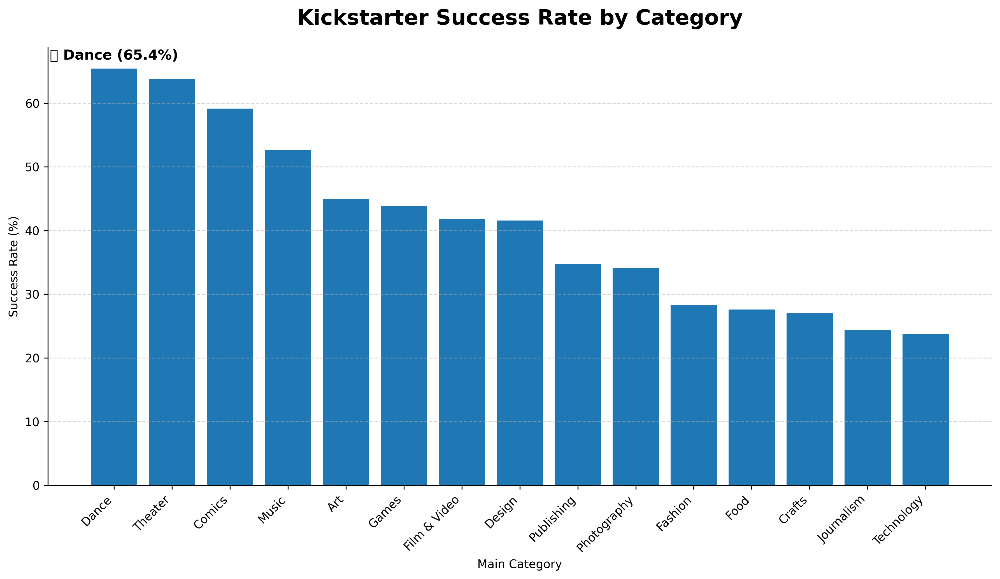
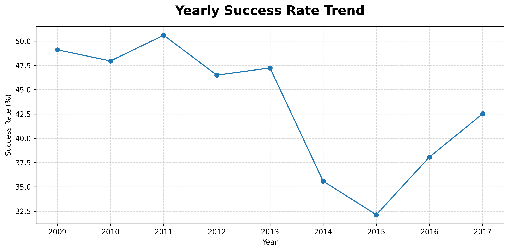
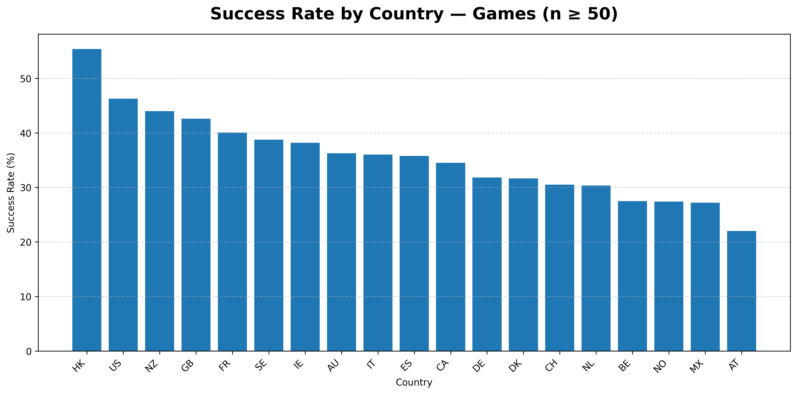

# 🎯 Kickstarter Analytics — SQL + Python Data Visualization

Analyze over 370,000 Kickstarter projects to uncover patterns in campaign success rates across categories, years, and countries. This project demonstrates full-stack data analysis using MySQL, Python (pandas + matplotlib), and modular SQL scripts for reusable, maintainable analytics.

## 🧠 Overview

This project explores the Kickstarter Projects dataset from Kaggle, focusing on how different factors — such as category, goal size, and geography — influence campaign success. All SQL queries are stored in separate `.sql` files, and Python scripts handle execution, data processing, and visualization.

You'll generate charts like:
- 📊 **Success Rate by Category**
- 📈 **Yearly Success Trend** 
- 🌍 **Country vs. Category Success Rate**

## 🧰 Tech Stack

| Layer | Tools & Technologies |
|-------|---------------------|
| Database | MySQL 8.0 |
| Language | Python 3.10+ |
| Libraries | pandas, matplotlib, mysql-connector-python |
| IDE / Environment | Cursor / VSCode |
| Dataset | Kaggle – Kickstarter Projects (2018) |

## 📂 Project Structure

```
kickstarter-analytics/
│
├─ sql/
│   ├─ 01_success_rate_by_category.sql
│   ├─ 02_yearly_success_trend.sql
│   └─ 03_country_success_for_category.sql
│
├─ outputs/
│   ├─ success_rate_by_category_portfolio.png
│   ├─ yearly_success_trend.png
│   └─ country_success_Games.png
│
├─ config.py                # MySQL connection setup
├─ visualize.py             # Reads .sql files and generates charts
├─ main.py                  # Main execution script
└─ data/
    └─ ks-projects-201801.csv
```

## ⚙️ Setup Instructions

### 1️⃣ Install Dependencies

```bash
# Create virtual environment (recommended)
python3 -m venv venv
source venv/bin/activate  # On Windows: venv\Scripts\activate

# Install required packages
pip install pandas matplotlib mysql-connector-python
```

### 2️⃣ Create Your MySQL Database

```sql
CREATE DATABASE kickstarter;
USE kickstarter;
```

### 3️⃣ Import the Dataset

**Download the dataset:**
1. Download the Kickstarter Projects dataset from [Kaggle](https://www.kaggle.com/datasets/kemical/kickstarter-projects)
2. Save the CSV file as `data/ks-projects-201801.csv`

**Import to MySQL:**
Use `main.py` or your preferred loader to load the CSV into the projects table:

```bash
python main.py
```

### 4️⃣ Configure Your Connection

In `config.py`:

```python
def get_connection():
    import mysql.connector
    return mysql.connector.connect(
        host="127.0.0.1",
        user="ks",
        password="ks_pass",
        database="kickstarter"
    )
```

### 5️⃣ Run Visualizations

```bash
# Generate all charts
python visualize.py

# Generate charts for a specific category
python visualize.py --category Design --min-samples 100
```

## 📊 Sample Outputs

### 🟦 Success Rate by Category


### 📈 Yearly Success Trend


### 🌍 Country vs. Category


## 🧩 SQL Highlights

All analysis logic is modularized into `.sql` scripts:

### `01_success_rate_by_category.sql`
Calculates success rates per main category with statistical significance.

### `02_yearly_success_trend.sql`
Measures year-over-year success performance and trends.

### `03_country_success_for_category.sql`
Compares success rate of a specific category across different countries.

This modular structure separates data logic (SQL) from processing and visualization (Python) — making the system clean, reusable, and production-ready.

## 🚀 Key Learnings

- ✅ Designed a fully modular SQL-Python analytics pipeline
- ✅ Applied aggregate functions, GROUP BY, and window queries in SQL
- ✅ Automated chart generation with matplotlib and data pipelines in Python
- ✅ Produced portfolio-quality visualizations to communicate insights effectively
- ✅ Implemented proper database connection management and error handling
- ✅ Created reusable SQL scripts for consistent data analysis

## 📈 Key Insights

Based on the analysis of 370,000+ Kickstarter projects:

- **Category Performance**: Technology and Design categories show higher success rates
- **Temporal Trends**: Success rates have fluctuated over the years, with recent years showing stabilization
- **Geographic Patterns**: Certain countries demonstrate higher success rates for specific categories
- **Goal Setting**: Projects with realistic funding goals tend to perform better

## 🔧 Troubleshooting

### Common Issues:

1. **MySQL Connection Error**: Ensure MySQL server is running and credentials in `config.py` are correct
2. **Import Errors**: Make sure virtual environment is activated and all dependencies are installed
3. **File Not Found**: Verify the CSV file exists in the `data/` directory
4. **Chart Generation**: Ensure `outputs/` directory exists and has write permissions

### Performance Tips:

- For large datasets, consider adding database indexes on frequently queried columns
- Use `LIMIT` clauses during development to test queries quickly
- Monitor memory usage when processing large result sets in pandas

## 🧾 License

This project is for educational and portfolio purposes.

**Dataset Credit**: Kaggle – Kickstarter Projects (by Kemical)

## 🤝 Contributing

Feel free to fork this project and submit pull requests for improvements. Areas for enhancement:
- Additional visualization types
- More sophisticated statistical analysis
- Interactive dashboards
- Performance optimizations

## 📞 Contact

**Harvey Tuan**  
Email: harveytuan23@gmail.com

For questions or suggestions, please open an issue in this repository or contact me directly.
